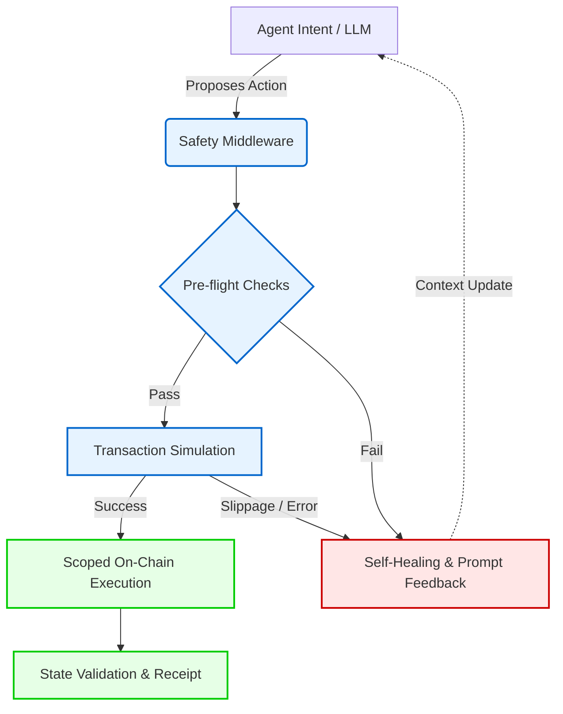

# Safe On-Chain Agent Skill

**Production-grade safety middleware and execution environment for autonomous AI agents on Solana.**

[](https://opensource.org/licenses/MIT)
[](https://github.com/sendaifun/solana-ai-kit)
[]()

---

## 🛑 The Problem: Agentic Trust on Solana

As AI agents move from read-only observers to active on-chain participants, the stakes are significantly higher. Standard agent tooling blindly signs transactions, leading to drained wallets from hallucinated parameters, MEV sandwich attacks due to incorrect slippage, or completely stalled workflows when RPCs return transient errors. 

An agent cannot truly act autonomously if a human is required to constantly monitor its execution, manually adjust slippage, or reset its state after a failed transaction.

## 🛡️ The Solution: Simulation-First Middleware

The **Safe On-Chain Agent Skill** introduces a rigorous safety middleware layer for the [Solana AI Kit](https://github.com/sendaifun/solana-ai-kit). It treats every agent intent as untrusted until mathematically verified via local pre-flight checks and mainnet simulation.

By utilizing scoped permissions, intelligent error recovery, and self-healing patterns, this skill ensures that your AI agents execute reliably, securely, and autonomously—even in highly volatile market conditions.

---

## ✨ Key Features

- **Simulation-First Execution:** No transaction is ever broadcast blindly. Every instruction is simulated against current mainnet state to verify exact token balances, slippage bounds, and compute budget constraints before signing.
- **Scoped Permissions & Wallet Hygiene:** Implement session keys and zero-trust policies. Agents are granted granular, time-bound allowances (e.g., "swap up to 10 USDC on Jupiter") rather than holding god-mode private keys.
- **Intelligent Error Parsing + Autonomous Retry:** Translates cryptic Solana program errors (e.g., `0x1`, `0x1771`) into semantic meaning. Automatically heals and retries on transient RPC errors, blockhash expirations, or minor slippage failures.
- **Pre-Flight Checks:** Validates token accounts, computes exact rent exemptions, and verifies required lamports for fees before initiating any complex on-chain logic.
- **Progressive / Token-Efficient Loading:** Designed for LLM context windows. Only the required ABIs and tool schemas are loaded into the prompt context when needed, saving tokens and reducing hallucination vectors.
- **Deep Composability:** Acts as a wrapper around existing Solana AI Kit tools (Jupiter, Meteora, Tensor), injecting safety guarantees without rewriting the underlying execution logic.

---

## 🏗️ Architecture Overview

The skill sits between the Agent's reasoning layer and the Solana RPC network, acting as an intelligent firewall.



---

## 📦 Installation

### One-Liner (Recommended)

Install the skill directly into your existing Solana AI Kit project:

```bash
npm install @cryptojigi/safe-onchain-agent-skill
```

### Custom Build / Source

For custom modifications or contributing to the skill:

```bash
git clone https://github.com/Cryptojigi/safe-onchain-agent-skill.git
cd safe-onchain-agent-skill
npm install
npm run build
```

---

## 🚀 Usage Examples

### 1. Safe Jupiter Swap (Guarded Execution)

Instead of using the default swap tool, route it through the Safe Executor. If the slippage simulation fails, the agent will automatically recalculate and retry without crashing the session.

```typescript
import { SafeAgentExecutor } from "@cryptojigi/safe-onchain-agent-skill";
import { JupiterPlugin } from "solana-ai-kit";

// Initialize with a scoped session key (max 50 USDC allowance)
const executor = new SafeAgentExecutor(connection, sessionKeypair, {
    maxComputeUnits: 800_000,
    strictSimulation: true,
    autoRetry: true
});

// The executor simulates the Jupiter route before broadcasting
const result = await executor.executeTool(JupiterPlugin.swap, {
    inputToken: "USDC",
    outputToken: "SOL",
    amount: 25.0,
    slippageBps: 50 // Executor will validate if this is realistic via simulation
});

console.log(result.receipt); // Confirmed on-chain tx signature
```

### 2. Autonomous Monitoring Agent (Self-Healing)

Agents running on cron jobs often fail due to expired blockhashes or transient RPC drops. The `SafeAgentExecutor` handles this gracefully.

```typescript
import { createMonitoringLoop } from "@cryptojigi/safe-onchain-agent-skill/utils";

// This loop runs every 5 minutes. If an RPC error occurs, the skill's
// self-healing module catches it, updates the RPC endpoint if necessary,
// and ensures the agent's state machine isn't broken.
createMonitoringLoop(async () => {
    const health = await executor.runPreFlightChecks();
    if (health.needsRebalance) {
        await executor.executeTool(MeteoraPlugin.adjustPosition, {
            pool: "SOL-USDC",
            targetRatio: 0.5
        });
    }
}, 300000);
```

### 3. Progressive Loading with Solana AI Kit

To keep your LLM context window small, load safety modules progressively based on the conversational context.

```typescript
import { setupSafeAgent } from "@cryptojigi/safe-onchain-agent-skill";
import { Agent } from "solana-ai-kit";

const agent = new Agent({
    model: "gpt-4o",
    // Only load the simulation schema when an on-chain action is detected
    skills: [setupSafeAgent({ progressiveLoad: true })]
});
```

---

## 🤝 Contributing

We welcome contributions to make on-chain agents safer for everyone. Please check out our [Contributing Guidelines](CONTRIBUTING.md) for details on submitting pull requests, setting up your development environment, and running the test suite.

1. Fork the repository
2. Create your feature branch (`git checkout -b feature/amazing-safety-check`)
3. Commit your changes (`git commit -m 'Add amazing safety check'`)
4. Push to the branch (`git push origin feature/amazing`)
5. Open a Pull Request

---

**Safe On-Chain Agent Skill** is built with ❤️ for the Solana AI ecosystem.
